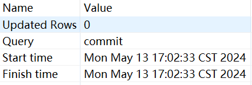
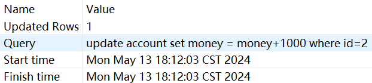
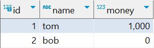
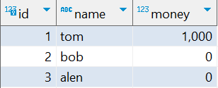
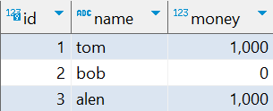
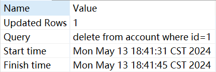
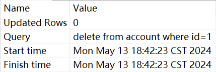

# 第七次实验
> 22371437 张智威

## Task1
### Q1
#### 语句2

#### 语句4

#### 语句5

#### 解析
&ensp; &ensp; &ensp;将两个事务都设置成`read uncommoditted`,在`session1`进行数据更新后，`session1`自己先读到自己更新后的数据即 2000 ，随后由于`session2`设置可读未提交的数据，因此也读到`session1`更新后的数据 2000 ，随后`session1`回退后，`session2`再查询得到的是未处理前的数据 1000。

### Q2-`read commited`
#### 语句2

#### 语句4

#### 语句5

#### 解析
&ensp; &ensp; &ensp;将两个事务都设置成`read commoditted`,在`session1`进行数据更新后，`session1`自己先读到自己更新后的数据即 2000 ，随后由于`session2`设置不可读未提交的数据，因此也读到`session1`更新前的数据 1000 ，随后`session1`回退后，`session2`再查询得到的是未处理前的数据 1000。

### Q2-`repeatable read`
#### 语句2

#### 语句4

#### 语句5

#### 解析
&ensp; &ensp; &ensp;原理与`read commited`类似。

### Q2-`serializable`
#### 语句2

#### 语句4
无筛选结果。

#### 语句5

#### 解析
&ensp; &ensp; &ensp;将两个事务都设置成`serializable`,在`session1`进行数据更新后，`session1`自己先读到自己更新后的数据即 2000 ，随后由于`session2&session1`设置为`serializable`，因此`session2`无法读到`session1`正在处理的数据，随后`session1`回退后，`session2`再查询得到的是未处理前的数据 1000。

### Q3
#### 语句2

#### 语句4

#### 解析
&ensp; &ensp; &ensp;由于将两个事务都设置成`read uncommoditted`,因此`session1`前面先读取到初始状态，后面`session2`提交了数据更改后`session1`再次读取就读取到了数据变化。

### Q4-`repeatable read`
#### 语句2

#### 语句4

#### 解析
&ensp; &ensp; &ensp;由于将两个事务都设置成`repeatable read`,因此`session1`前面先读取到初始状态，后面`session2`提交了数据更改时无法进行更新，`session1`再次读取时数据无变化。

### Q4-`serializable`
#### 语句2

#### 语句4

#### 解析
&ensp; &ensp; &ensp;由于将两个事务都设置成`serializable`,因此`session1`前面先读取到初始状态，后面`session2`提交了数据更改时无法进行更新，`session1`再次读取时数据无变化（在此处由于只设计更新操作，`serializable`与`repeatable read`类似）。

### Q5
#### T2时刻
&ensp; &ensp; &ensp;在`session1`进行提交操作前，`session2`的语句2一直处于停滞状态，没有响应，在`session1`提交之后，`session2`的语句2成功操作并返回。

#### T4时刻
&ensp; &ensp; &ensp;`session2`即刻返回成功的消息，返回的内容与上图相同。

#### 解析
&ensp; &ensp; &ensp;由于`session1`和`session2`的状态都设置成`repeatable read`，导致`session1`在读取数据后，`session2`希望对数据进行修改无法完成，等待`session1`提交后释放锁，`session2`才能实现数据更新，而`session1`提交后`session2`再次尝试更新，由于数据没有上锁，更新的步骤立刻得以完成。

### Q6
#### 语句2

#### 语句4

#### 语句6

#### 语句7

### Q7
#### 语句2

#### 语句4

### Q8
&ensp; &ensp; &ensp;在`repeatable read`的权限下，`session2`是能够成功的执行`insert`操作和读取到新插入的行的，而加了`lock in share mode`或改为`serializable`后，在`session1`进行提交操作前，`session2`的所有操作都被阻塞，无法进行。 
&ensp; &ensp; &ensp;这是由于在`repeatable read`的权限下，`session2`只是被限制了修改表的权限，但是能够新增表中的内容，而由于`快照读`的存在，即使`session2`进行了提交操作，`session1`中读取到的数据仍是复制出的数据库镜像中的数据，即实际上数据库中已经新插入了数据但是`session1`不会读出来。 
&ensp; &ensp; &ensp;而加了`lock in share mode`或改为`serializable`后，实际上真实对表进行了加锁的操作，使得`session2`只能读表中的内容，不能修改表中的内容，因此才有上述情况产生。

### Q9
#### 语句2

#### 语句3

#### 解析
&ensp; &ensp; &ensp;在`session1`进行了`update`语句后加上排他锁，导致`session2`的`delete`语句被阻塞，直到`session1`进行提交后，才进行删除操作，而第二次删除操作由于先前已经进行了删除于是没有行被删除。

## Task2
### Q10
&ensp; &ensp; &ensp;由于`session1`先对A表进行更新操作对A表加上排他锁，`session2`再对B表进行更新操作对B表加上排他锁，随后`session1`申请对B更新，需要等待`session2`释放B的锁，`session2`申请对A更新，需要等待`session1`释放A的锁，二者互相需要对方释放锁，因此陷入死锁。