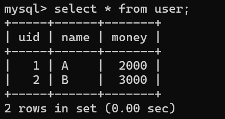
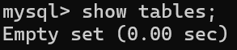
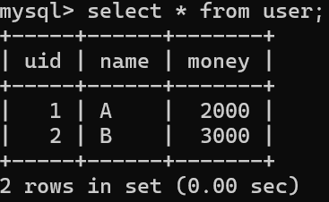
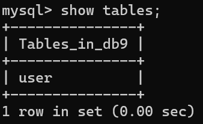
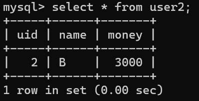
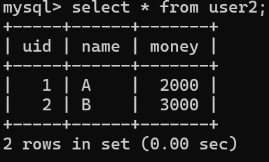

# 第八次实验
>张智威<br>22371437

## Task1
### 1
```
CREATE DATABASE db9;

USE db9;

CREATE TABLE user (
    uid INT PRIMARY KEY,
    name VARCHAR(50),
    money INT
);

INSERT INTO user (uid, name, money) VALUES (1, 'A', 2000);
INSERT INTO user (uid, name, money) VALUES (2, 'B', 3000);

select * from user;
```
#### 删除前查询结果
<div align='center'></div>

### 2
```
mysqldump -u root -p db9 user > C:\Users\ROG\Desktop\课程\数据库\22371437_张智威_第八次实验/save.sql
```

### 3
```
drop table user;

select * from user;
```

#### 删除后查询结果
<div align='center'></div>

<div align='center'></div>

### 4
```
mysql -u root -p db9 < C:\Users\ROG\Desktop\课程\数据库\22371437_张智威_第八次实验/save.sql
```

#### 恢复后查询结果
<div align='center'></div>

<div align='center'></div>

## Task2
### 1
```
CREATE TABLE user2 (
    uid INT PRIMARY KEY,
    name VARCHAR(50),
    money INT
);

INSERT INTO user2 (uid, name, money) VALUES (1, 'A', 2000);
INSERT INTO user2 (uid, name, money) VALUES (2, 'B', 3000);
```

### 2
```
delete from user2 where name = 'A';
```

### 3
```
delete from user2 where name = 'B';
```

### 4
```
show binlog events in 'binlog.000049';

mysqlbinlog --no-defaults --start-position=3170 --stop-position=3459 "C:\Program Files\mysql-8.0.36-winx64\data\binlog.000049" | mysql -uroot -pA1634257694zcx
```

#### 恢复后查询结果
<div align='center'></div>

### 5
```
mysqlbinlog --no-defaults "C:\Program Files\mysql-8.0.36-winx64\data\binlog.000049"

mysqlbinlog --no-defaults --start-datetime="2024-05-23 16:38:39" --stop-datetime="2024-05-23 16:38:39" "C:\Program Files\mysql-8.0.36-winx64\data\binlog.000049" | mysql -uroot -pA1634257694zcx
```

#### 恢复后查询结果
<div align='center'></div>