# 第六次实验
> 22371437 <br> 张智威

## Task1
### 1-1
#### 创建函数
```
delimiter //

create function find_code(input_name varchar(25),input_code varchar(15),new_code varchar(15),flag int) returns bool
begin
    declare check_code varchar(15) default null;
    declare check_name varchar(25);
    declare done int default 0;
    declare user_cursor cursor for select name, code from 账户;
    declare continue handler for not found set done = 1;
    
    open user_cursor;

    while done = 0 do
        fetch user_cursor into check_name, check_code;
       
        if check_name = input_name then
            if flag = 1 then
                if check_code != input_code then
                	return false;
                else
                	return true;
                end if;
            else
                if check_code != input_code then
                	return false;
                elseif length(new_code) < 4 or length(new_code) > 10 or not(new_code regexp '^[a-zA-Z0-9]+$') then
                	return true;
                else
                    update 账户 set code = new_code where name = input_name;
                   	return true;
                end if;
            end if;
		end if; 
	
	end while;

    close user_cursor;
   	return false;
end //
delimiter ;

```
#### 调用函数测试
```
select find_code('1234','123456','11111',1)
```
<div align=center></div>

```
select find_code('1234','12345','11111',1)
```
<div align=center>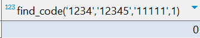</div>

```
select find_code('1234','123456','11111',2)
```
<div align=center>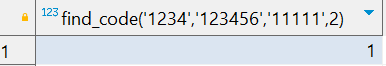</div>

```
select find_code('1234','123456','11111号',2)
```
<div align=center>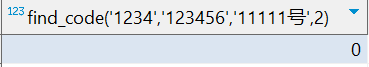</div>

### 1-2
#### 创建函数
```
delimiter //
create function borrow(input_name varchar(15), input_ISBN int) returns bool
begin
	if not exists(select * from 账户 where name = input_name)
	or (select number from book where ISBN = input_ISBN) < 1
	or exists(select * from borrowrecords where Username = input_name and ISBN = input_ISBN) then 
		return false;
	else
		insert into borrowrecords(Username,ISBN) values (input_name,input_ISBN);
		update book set number = number - 1 where ISBN = input_ISBN;
		return true;
	end if;
return false;
end //
delimiter ;
```
#### 调用函数测试
```
select borrow('1234',1)
```
<div align=center>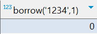</div>
ps：因为初始时已经添加了一条‘1234’借 ISBN 为 1 的书的记录

```
select borrow('1234',2)
```
<div align=center></div>

```
select borrow('1234',3)
```
<div align=center></div>
ps：因为 ISBN 为 3 的书的数量为 0

### 1-3
#### 创建函数
```
delimiter //
create function return_book(input_name varchar(15), input_ISBN int) returns bool
begin
	if not exists(select * from borrowrecords where Username = input_name and ISBN = input_ISBN) then 
		return false;
	else
		update borrowrecords set ReturnDate = NOW() where Username = input_name and ISBN = input_ISBN;
		update book set number = number + 1 where ISBN = input_ISBN;
		return true;
	end if;
return false;
end //
delimiter ;
```

#### 调用函数测试
```
select return_book('1234',1)
```
<div align=center>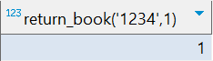</div>

```
select return_book('1234',3)
```
<div align=center>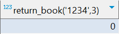</div>

```
select return_book('12345',3)
```
<div align=center>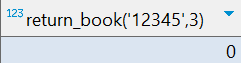</div>

### 1-4
#### 创建存储过程
```
delimiter //
create procedure find_borrow(in input_name varchar(15))
begin
	select Username as 用户名, ISBN, DueDate as 到期时间 from borrowrecords where Username = input_name;
end //
delimiter ;
```

### 调用过程测试
```
call find_borrow('1234')
```
<div align=center>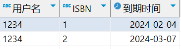</div>

```
call find_borrow('2345')
```
<div align=center>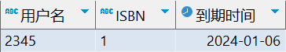</div>

```
call find_borrow('3456')
```
<div align=center></div>

## Task2
### 2-1
```
CREATE TABLE fruits (
    fid INT PRIMARY KEY,
    fname VARCHAR(50),
    price DECIMAL(10, 2)
);

INSERT INTO fruits (fid, fname, price) VALUES (1, 'Apple', 2.50);
INSERT INTO fruits (fid, fname, price) VALUES (2, 'Banana', 1.50);

CREATE TABLE sells (
    fid INT,
    cid INT,
    sellTime DATETIME,
    quantity INT,
    FOREIGN KEY (fid) REFERENCES fruits(fid)
);

CREATE TABLE customer (
    cid INT PRIMARY KEY,
    cname VARCHAR(50),
    level VARCHAR(20)
);

INSERT INTO customer (cid, cname, level) VALUES (1, 'Alice', 'normal');
```

### 2-2
```
delimiter //
create trigger check_fid_exist
before insert on sells
for each row
begin
    if not exists(select fid from fruits where fid = new.fid) then
        signal sqlstate '45000' set message_text = '该水果数据不存在';
    end if;
end //
delimiter ;
```

### 2-3
```
delimiter //
create trigger check_cid_exist
before insert on sells
for each row
begin
    if not exists(select cid from customer where cid = new.cid) then
        insert into customer(cid,level) values(new.cid,'normal');
    end if;
end //
delimiter ;
```

### 2-4
```
delimiter //
create trigger triADD
after insert on sells
for each row
begin
	declare total_price int default 0;
   	select sum(f.price * s.quantity) into total_price
    from fruits f, sells s
    where f.fid = new.fid and s.fid = f.fid;
   
   	if total_price > 20000 then
   		update customer set level = 'SVIP' where cid = new.cid;
   	elseif total_price > 10000 then
   		update customer set level = 'VIP' where cid = new.cid;
   	else
   		update customer set level = 'normal' where cid = new.cid;
   	end if;
end //
delimiter ;
```

### 2-5
#### triDEL
```
delimiter //
create trigger triDEL
after delete on sells
for each row
begin
	declare total_price int default 0;
   	select sum(f.price * s.quantity) into total_price
    from fruits f, sells s
    where f.fid = old.fid and s.fid = f.fid;
   
   	if total_price > 20000 then
   		update customer set level = 'SVIP' where cid = old.cid;
   	elseif total_price > 10000 then
   		update customer set level = 'VIP' where cid = old.cid;
   	else
   		update customer set level = 'normal' where cid = old.cid;
   	end if;
end //
delimiter ;
```
#### triUPT
```
delimiter //
create trigger triUPT
after update on sells
for each row
begin
	declare total_price int default 0;
   	select sum(f.price * s.quantity) into total_price
    from fruits f, sells s
    where f.fid = old.fid and s.fid = f.fid;
   
   	if total_price > 20000 then
   		update customer set level = 'SVIP' where cid = old.cid;
   	elseif total_price > 10000 then
   		update customer set level = 'VIP' where cid = old.cid;
   	else
   		update customer set level = 'normal' where cid = old.cid;
   	end if;
end //
delimiter ;
```

### 2-6
#### 测试使用的存储过程
```
delimiter //
create procedure test()
begin
	DECLARE code CHAR(5) DEFAULT '';
  	DECLARE msg TEXT;
  	DECLARE result TEXT;
  
	DECLARE CONTINUE HANDLER FOR sqlexception
	BEGIN
    	GET DIAGNOSTICS CONDITION 1
        code = RETURNED_SQLSTATE, msg = MESSAGE_TEXT;
	END;
	
	insert into sells(fid, cid, quantity) values(1,1,2000),(2,1,3000);
	insert into sells(fid, cid, quantity) values(3,1,2000);  # 测试check_fid_exist不存在情况
	select CONCAT('errorCode = ',code,', errorMessage = ',msg) as 错误信息;
	# 测试check_cid_exist不存在情况
	insert into sells(fid, cid, quantity) values(1,2,1500);  
	# 测试是否插入了新的cid
	select * from customer where cid = 2;					 
	insert into sells(fid, cid, quantity) values(2,2,7000);  
	# 测试triADD是否生效
	insert into sells(fid, cid, quantity) values(1,1,4000);  
	select level from customer where cid = 1;				 
	# 测试triUPT是否生效
	update sells set quantity = 10000 where fid = 1 and cid = 1;
	select level from customer where cid = 1;
	
	insert into sells(fid, cid, quantity) values(1,1,10000);

	# 测试triDEL是否生效
	delete from sells where fid = 1 and cid = 1; 
	select level from customer where cid = 1;
end //
delimiter ;
```
#### 结果
##### `check_fid_exist`中 fid 不存在
<div align=center>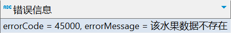</div>

##### `check_cid_exist`中 cid 不存在
<div align=center>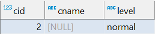</div>

##### `triADD`测试
<div align=center></div>

##### `triUPT`测试
<div align=center>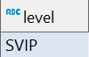</div>

##### `triDEL`测试
<div align=center>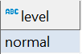</div>