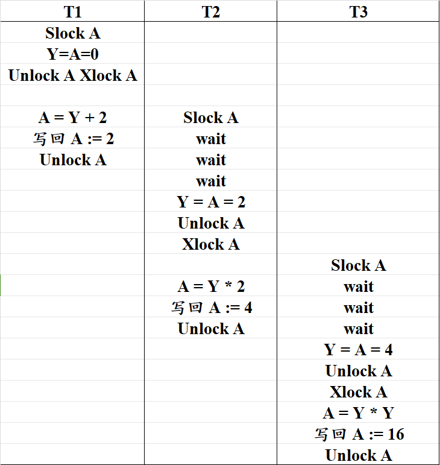
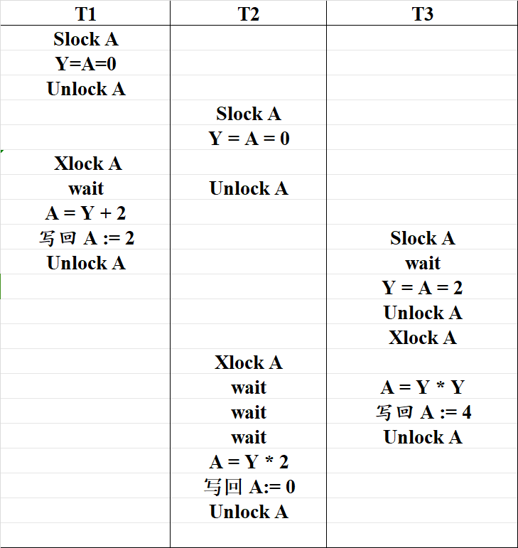
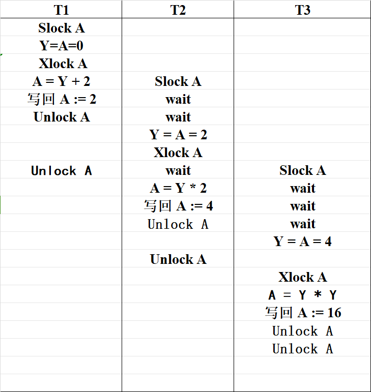
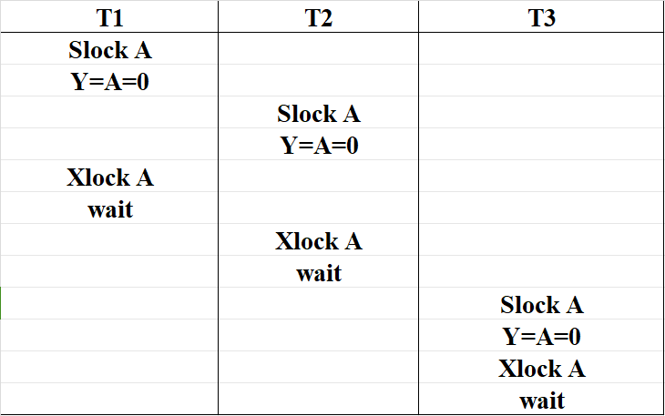
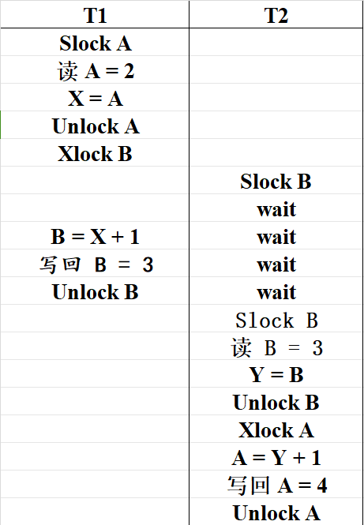
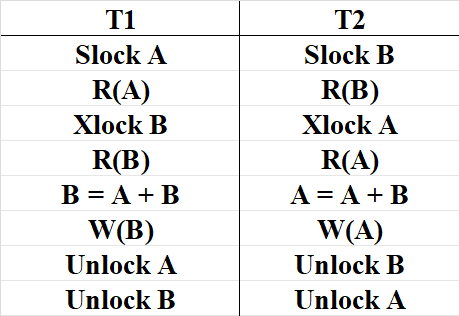
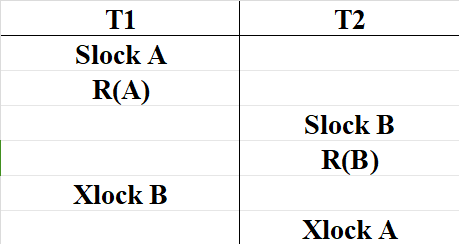

# 第八次作业
## 22371437 张智威
### 课本P303
#### T1
* 事务的概念：事务(Transaction)是用户定义的一个数据库操作序列，这些操作要么全做，要么全不做，是一个不可分割的工作单位。
* 事务的四个特性：原子性，一致性，隔离性，持续性。
* 数据库的恢复机制保证了原子性和持久性的实现。

#### T2
&ensp; &ensp; &ensp;设计一个转账的事务，从卡A转500元至卡B，假设原来卡A有余额Q，则定义一个事务T，包含两个操作：QA = QA - 500, QB = Qb + 500,若在完成第一步操作后非正常终止，则账户A中凭空少了500元，破坏了数据库数据的正确性。

### 课本P326
#### T1
* 当多个用户并发存取同一数据块时，如果对并发操作不加控制可能会产生不正确的数据，破坏数据的一致性；DBMS必须对并发操作进行控制，避免破坏数据一致性。
* 保证事务的一致性，隔离性。

#### T2
* 并发操作可能会产生丢失修改，不可重复读，读“脏”数据的数据不一致。
* 封锁方法，时标方法，乐观方法，多版本并发控制等可以避免各种不一致的情况。

#### T3
* 封锁就是事务T在对某个数据对象（例如表、记录等）操作之前，先向系统发出请求，对其加锁。
* 基本的封锁类型有排它锁，共享锁。
  * 排他锁：若事务T对数据对象A加上X锁，则只允许T读取和修改A，其它任何事务都不能再对A加任何类型的锁，直到T释放A上的锁
  * 共享锁：若事务T对数据对象A加上S锁，则其它事务只能再对A加S锁，而不能加X锁，直到T释放A上的S锁

#### T4
&ensp; &ensp; &ensp;基于锁这个工具，设计一组规则，来合理安排一组并发事务的交错运行的指令，使得产生的调度是可串行的和可恢复的，甚至是无级联的。即通过封锁协议来保证数据的一致性。

#### T6
* 死锁：如果事务T1封锁了数据R1，T2封锁了数据R2，然后T1又请求封锁R2，因T2已经封锁了R2，于是T1等待T2释放R2上的锁；接着T2又申请封锁R1，因为T1已经封锁了R1，T2也只能等待T1释放R1上的锁，这样就出现了T1在等待T2，而T2又在等待T1的情况，T1和T2两个事务永远不能结束，形成死锁。
* 预防死锁的方法：
  * 一次封锁法：要求每个事务必须一次将所有要使用的数据全部加锁，否则就不能继续执行
  * 顺序封锁法：预先对数据对象规定一个封锁顺序，所有事务都按这个顺序实施封锁

#### T7
* 等待图法检测死锁：用事务等待图动态反映所有事务的等待情况，系统进行周期性检查，如果发现图中存在回路，则表示出现了死锁，为此选择一个事务回滚，打破死锁。
* 解除死锁：选择一个处理死锁代价最小的事务，将其撤销，释放此事务所持有的所有的锁，使其他事务得以继续运行下去。

#### T8
* 可串行化的调度是正确的调度。

#### T9
##### （1）
* 16：T1-T2-T3
* 8: T1-T3-T2
* 4: T2-T1-T3 || T3-T1-T2
* 2: T2-T3-T1 || T3-T2-T1

##### （2）
* 可串行化的调度：

* 结果：16

##### （3）
* 非可串行化的调度：

* 结果: 0

##### （4）
* 不产生死锁的可串行化调度：

##### （5）
* 产生死锁的调度：

#### T10
&ensp; &ensp; &ensp;是可串行化调度，因为可以通过不冲突操作转化为Sc=r3(B)r3(A)r2(B)r2(B)r2(A)r1(B)r1(B)r1(A)

#### T12

#### T13
* ③ 属于 ① = ②
* ④ 属于 ①

#### T14
* ①：

* ②：可能会产生死锁，如下图所示：

### 课堂练习
#### 第一题
* 可串行的：S1，S3
* 可恢复的：S2，S3

#### 第二题
* (1)：是正确的调度，等价于Sc = r1(X) w1(X) r1(Y) w1(Y) r2(X) r2(Y) w2(Y) w2(X) 
* (2): 不是严格两阶段协议的调度，因为在T1事务未结束时，就已经释放了X的锁。