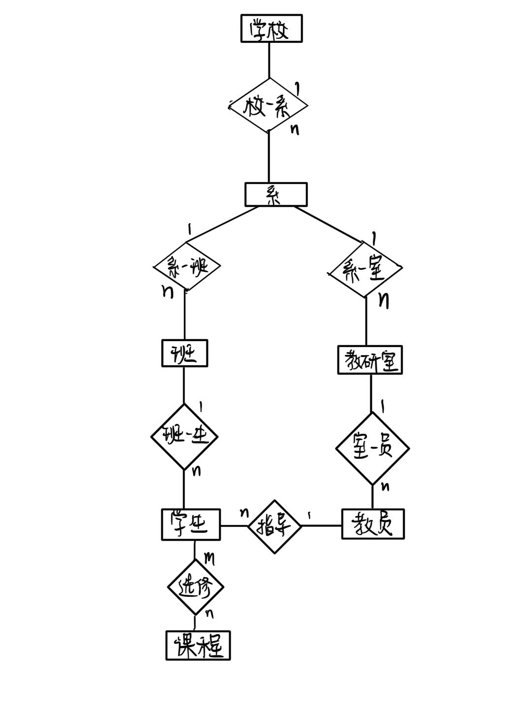
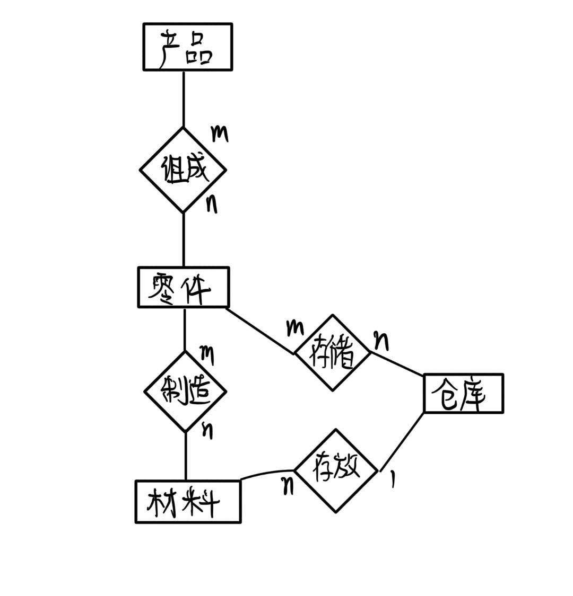

# 第十二次作业
> 22371437 张智威

## 1
* 数据库设计过程大致分为：
  * 需求分析
  * 概念结构设计
  * 逻辑结构设计
  * 数据库物理设计
  * 数据库实施
  * 数据库运行和维护

## 3
* 需求分析阶段的设计目标是通过详细调查现实世界要处理的对象，充分了解原系统工作概况，明确用户的各种需求，然后在此基础上确定新系统的功能。
* 调查的内容是“数据”和“处理”，即获得用户在数据管理中的信息要求、处理要求、安全性与完整性要求。

## 4
* 数据字典的内容通常包括数据项，数据结构，数据流，数据存储，处理过程。数据项是数据的最小组成单位，若干个数据项可以组成一个数据结构。数据字典通过对数据项和数据结构的定义来描述数据流、数据存储的逻辑内容。
* 数据字典的作用：数据字典是关于数据库中数据的描述，在需求分析阶段建立，是下一步进行概念设计的基础，并在数据库设计过程中不断修改，充实和完善。

## 5
* 概念结构是信息世界的结构，即概念模型。
* 概念结构的特点：
  * 能真实、充分地反映现实世界，包括事物和事物之间的联系，能满足用户对数据的处理要求。是对现实世界的一个真实模型。
  * 易于理解，从而可以用它和不熟悉计算机的用户交换意见，用户的积极参与是数据库的设计成功的关键。
  * 易于更改，当应用环境和应用要求改变时，容易对概念模型修改和扩充。
  * 易于向关系、网状、层次等各种数据模型转换。
* 概念结构的设计策略：
  * 自底向上进行概念结构设计：首先定义各局部应用的概念结构，然后将它们集成起来，得到全局概念结构。
  * 自顶向下进行需求分析：首先定义全局概念结构的框架，然后逐步细化。
  * 逐步扩张：首先定义最重要的核心概念结构，然后将它们集成起来，得到全局概念结构。
  * 混合策略：将自顶向下和自底向上相结合，用自顶向下策略设计一个全局概念结构的框架，以它为骨架集成由自底向上策略中设计的各局部概念结构。

## 6
* 实体：客观存在并且可以相互区分的事物。
* 实体型：具有相同属性的实体具有相同的特征和性质，用实体名及其属性名集合来抽象和刻画同类实体称为实体型。
* 实体集：同类实体的集合称为实体集。
* 属性：实体所具有的某一特性。
* 码：唯一标识实体的属性集。
* 实体-联系图：描述实体型，属性和联系的一种方法。
  * 实体型用矩形表示，矩形框内写明实体名。
  * 属性用椭圆形表示，并用无向边将其与相应的实体型连接起来。
  * 联系用菱形表示，菱形框内写明联系名。

## 7

## 8

## 9
* 数据库的逻辑结构设计就是把概念结构设计阶段设计好的基本E-R图转换为与选用的DBMS产品所支持的数据模型相符合的逻辑结构。
* 设计步骤：
  * 将概念结构转化为关系模型；
  * 对数据模型进行优化。

## 10
注：加下划线的是主码属性。
### 习题7
* 系（<u>系编号</u>，系名，学校名）
* 班级（<u>班级号</u>，班名，系编号）
* 教研室（<u>教研室号</u>，教研室名称，系编号）
* 学生（<u>学号</u>，姓名，班级编号，导师职工号）
* 课程（<u>课程编号</u>，课程名）
* 教员（<u>职工号</u>，名字）
* 选课（<u>学号，课程编号</u>，成绩）

### 习题8
* 产品（<u>产品号</u>，产品名，仓库号）
* 零件（<u>零件号</u>，零件名）
* 原材料（<u>原材料号</u>，原材料名，仓库号）
* 仓库（<u>仓库号</u>，仓库名）
* 产品组成（<u>产品号，零件号</u>，零件量）
* 零件组成（<u>零件号，原材料号</u>，原材料量）
* 零件存储（<u>零件号，仓库号</u>，存储量）

## 11
&ensp; &ensp; 习题7中各个关系模式的码如下划线标注所示，这些关系模式都只有一个码，且都是唯一决定的因素，都属于BCNF，不会产生更新异常。

## 12
&ensp; &ensp; 规范化理论为数据库设计人员判断关系模式优劣提供了理论标准，可以知道关系数据模型的优化，用来预测模式可能出现的问题。